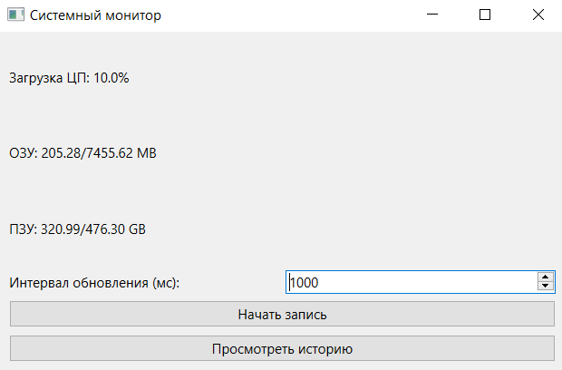
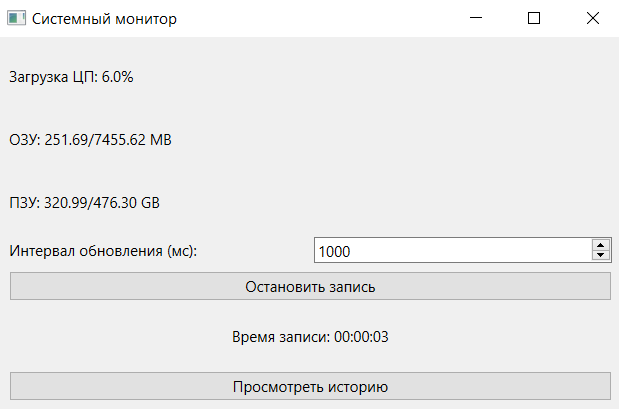
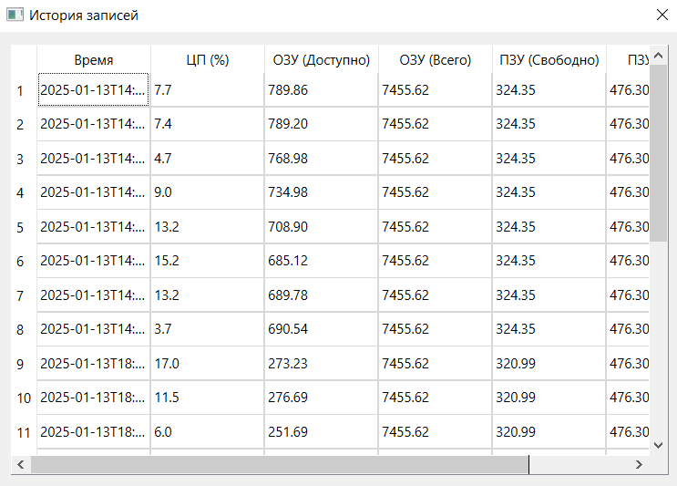
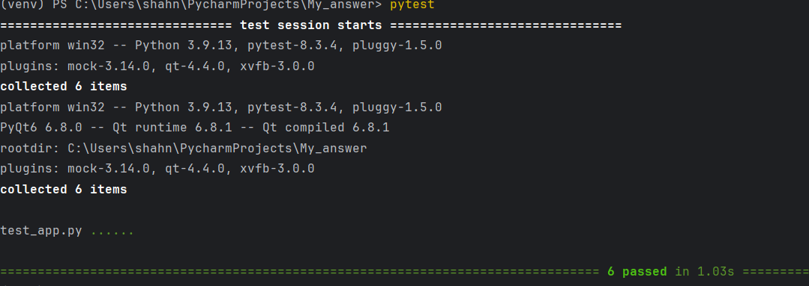

# Durability UI

## Описание

Для работы приложения используется MongoDB для хранения данных.

## Установка

### 1. Клонирование репозитория

Склонируйте репозиторий с GitHub:

    git clone https://github.com/BackLagg/Durability_UI.git
    cd Durability_UI

### 2. Установка зависимостей для бэкенда
Создайте виртуальное окружение и установите зависимости:

    python -m venv venv
    source venv/bin/activate  # Для Linux/Mac
    venv\Scripts\activate     # Для Windows
    pip install -r requirements.txt

### 3. Настройка базы данных
Для работы с MongoDB необходимо указать параметры подключения в .env файле. Отредактируйте .env файл в корневой директории проекта

## Запуск

После установки проекта запустите его.
    
    python App.py

Для запуска тестов:
    
    pytest

## Скриншоты работы приложения

### Главный интерфейс

### Окно журнала

### Тесты
